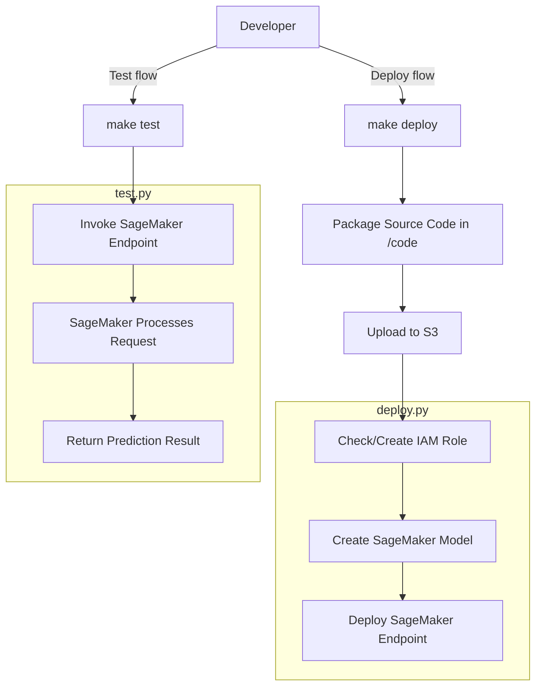

# Sagemaker SCVI Model

This is a simple example of how to deploy a model using Sagemaker.

## Deploying the model
This will package the source code in `code/` and upload it to S3. It will also create a SageMaker model and deploy an endpoint.
If needed, it will also create a new IAM role which allows SageMaker to access the model artifacts and the data in S3.

```bash
make deploy
```

## Testing the model

```bash
make test
```

## Deployment & Testing Flow
High level summary: 
- Modify model code in `code/`
- Run `make deploy` to package and upload model code to S3 and deploy the model to SageMaker
- Run `make test` to test the model


